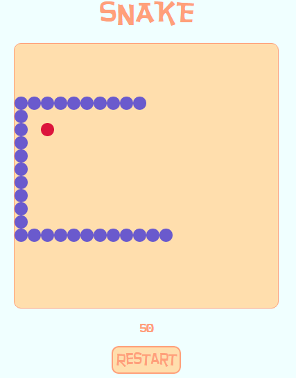

# E-DOM

## Snake

[Live][link]
[link]: http://cezekwe1.github.io/E-DOM/



## Description

E-DOM is a lightweight JavaScript library. Inspired by JQuery, it simplifies DOM manipulation. It allows for HTML document traversal, event handling, and AJAX requests in JavaScript.

## Installation

Download E-DOM by downloading and add to project directory whenever necessary add to top of page:

``` javascript
  const $e = require('../lib/main.js');
```


### Examples


#### Element and Class Retrieval

E-DOM allows makes it possible to grab HTML element or CSS classes and make them DOM nodes for manipulation.

HTML...

``` javascript
const espan = $e('span');
```

CSS...

``` javascript
  const eclass = $e('.ending');
```


#### AJAX

E-DOM allows you to make ajax requests.

``` javascript
    $e.ajax({
    type: 'GET',
    url: "http://api.openweathermap.org/data/2.5/weather?q=London,uk&appid=bcb83c4b54aee8418983c2aff3073b3b",
    success(data) {
      console.log("We have your weather!")
      console.log(data);
    },
    error() {
      console.error("An error occurred.");
    },
    });
```


### `DOMNodeCollection.prototype` Methods

#### `html`
* Takes in optional argument. With no argument the first `innerHTML` element is returned, with an argument the `innerHTML` of each node is set to the argument.

#### `empty`
* This empties out a HTML element.

#### `append`
* Appends outerHTML element to an innerHTML of every node element in a collection.

#### `attr`
* Takes and attribute and a value(optional). Given both a matched attribute is set to the passed in value, given just the attribute a collection of corresponding nodes are returned.

#### `addClass`
* Adds class passed in as an argument to every node in a collection.

#### `removeClass`
* Removes class passed in as an argument from all HTML element of a node collection.

#### `children`
* Returns all child nodes.

#### `parent`
* Returns all parent nodes.

#### `find`
* Finds nodes correspondent to selector passed in as an argument.

#### `remove`
* Removes all nodes and html from a node collection.

#### `on`
* Adds event listener to a node element.
#### `off`
* Removes event listener from a node element.

#### `eq`
* Accepts an index as argument and returns corresponding node.
